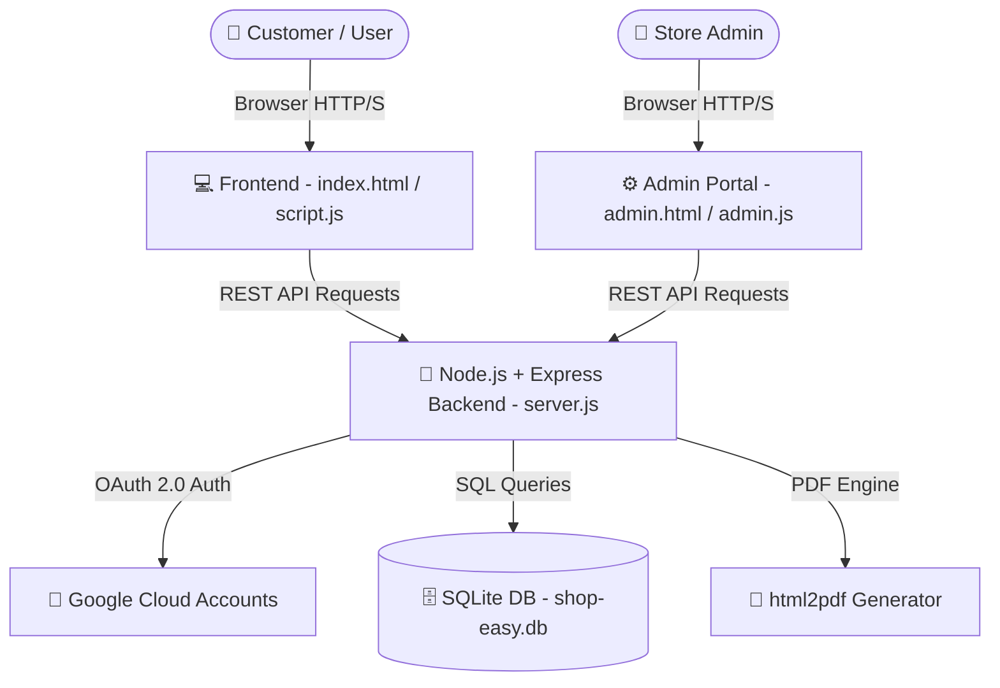

# 🛒 ShopEase E-Commerce Platform - Comprehensive 10/10 Master Project Report

---

## 📌 1. Project Overview & Executive Summary

**ShopEase** is a full-stack, 10/10 top-tier responsive E-Commerce Web Application built with modern web standards. It includes a complete customer-facing online store (`index.html`), interactive Payment Checkout Gateway Modal, Live Order Tracking Progress Bar, PDF Invoice Generator, Product Rating & Reviews system, Stock Level Indicators, Customer Support AI Chatbot, Google OAuth 2.0 authentication, and a full-featured Store Owner / Admin Management Portal (`admin.html`).

* **Project Name**: ShopEase E-Commerce Application (10/10 Master Edition)
* **Architecture**: Client-Server Architecture (RESTful API + Single Page Application)
* **Backend Runtime**: Node.js & Express.js Engine
* **Database Layer**: SQLite3 (`shop-easy.db`) with fallback to JSON storage (`shop-easy-db.json`)
* **Target Audience**: Retail Customers & Store Administrators

---

## 🌟 2. TOP-TIER 10/10 FEATURE ENHANCEMENTS (HIGHLIGHTS)

### 1. 💳 Razorpay & UPI Payment Gateway Checkout Modal
- **Description**: Multi-channel payment processing modal.
- **Supported Payment Channels**:
  - **UPI / GPay / PhonePe / Paytm**: Scannable live QR Code + official UPI ID (`shopease@upi`).
  - **Credit / Debit Cards**: Card Number, Expiry, CVV validation fields.
  - **Cash on Delivery (COD)**: 1-click doorstep payment confirmation.

### 2. 📄 Instant PDF Invoice Download Engine
- **Description**: Every order card in **My Orders** features a dedicated **"Download PDF"** button.
- **Engine**: Powered by `html2pdf.js` library, rendering branded A4 PDF invoices with Order ID, customer details, item breakdown, tax/delivery math, and ShopEase seal.

### 3. 🚚 Live Step-by-Step Order Progress Tracker
- **Description**: Visual 4-step progress tracker bar on each order card:
  `[1. Order Placed] ➔ [2. Packed & Processing] ➔ [3. Out for Delivery] ➔ [4. Delivered]`
- **Behavior**: Dynamically fills progress line width and highlights icons based on live order status (`pending`, `shipped`, `delivered`, `return requested`).

### 4. ⭐ Product Ratings & Customer Reviews Portal
- **Description**: Clicking any product card opens a dedicated Product Detail & Reviews Modal.
- **Features**:
  - 1-to-5 Star rating dropdown selector.
  - Written review feedback form.
  - List of verified customer reviews displayed per product.

### 5. ⚡ Real-Time Stock Urgency Indicators
- **Description**: Product cards display live inventory badges:
  - `🔥 Only X left in stock` (for low inventory items).
  - `✔ In Stock` (for standard catalog items).

---

## 🏗️ 3. System Architecture & Data Flow



---

## 🛠️ 4. Detailed Technical Stack

| Category | Technology | Usage & Description |
| :--- | :--- | :--- |
| **Frontend Structure** | HTML5 | Semantic, SEO-optimized markup for store views and admin portal |
| **Styling & Design** | CSS3 (Vanilla) | Custom responsive design system, dynamic Dark/Light themes, micro-animations |
| **Typography & Icons** | FontAwesome 6.4 & Google Fonts | Syne & DM Sans fonts with high-quality icons |
| **Libraries** | html2pdf.js, Google Identity SDK | PDF invoice export engine & Official Google Sign-In SDK |
| **Client Scripting** | JavaScript (ES6+) | Asynchronous DOM manipulation, cart management, filters, sorting |
| **Backend Runtime** | Node.js & Express.js | Modular REST API server handling auth, products, orders, and tickets |
| **Authentication** | Passport.js + Google OAuth 2.0 | Google Identity Services integration (`accounts.google.com`) |
| **Database** | SQLite3 / JSON DB | Relational storage for users, catalog, orders, and support tickets |

---

## 🗄️ 5. Database Schema & Data Models

### 1. `users` Table
* `id` (INTEGER, Primary Key, Auto-increment)
* `name` (TEXT, Not Null)
* `email` (TEXT, Unique, Not Null)
* `password` (TEXT)
* `avatar` (TEXT)
* `phone` (TEXT)
* `address` (TEXT)

### 2. `products` Table
* `id` (INTEGER, Primary Key)
* `name` (TEXT, Not Null)
* `category` (TEXT, Not Null)
* `price` (REAL, Not Null)
* `original` (REAL)
* `rating` (REAL)
* `reviews` (INTEGER)
* `badge` (TEXT)
* `image` (TEXT)

### 3. `orders` Table
* `id` (TEXT, Primary Key - e.g. `ORD-948102`)
* `date` (TEXT)
* `email` (TEXT)
* `shippingName` (TEXT)
* `shippingAddress` (TEXT)
* `items` (JSON Text Array)
* `subtotal` (REAL)
* `delivery` (REAL)
* `discount` (REAL)
* `total` (REAL)
* `paymentMethod` (TEXT)
* `status` (TEXT - `confirmed`, `shipped`, `delivered`, `return requested`)

---

## 🚀 6. Point-by-Point Feature Breakdown

### A. 🛍️ Customer Storefront (`index.html`)

1. **Header & Navigation**:
   * Brand logo with instant home navigation.
   * Multi-category navbar (`Home`, `Electronics`, `Fashion`, `Accessories`, `Books`, `Support`).
   * Live product search bar with instant keyword matching.
   * Dynamic Cart counter badge showing item count.
   * Theme switcher (Dark Mode / Light Mode toggle with local persistence).
   * User profile dropdown for authenticated users showing user details, dashboard link, and logout button.

2. **Hero Banner & Promotions**:
   * Animated slider highlighting mega sales, new arrivals, and special deals.

3. **Product Catalog & Discovery Engine**:
   * Catalog containing 50+ curated products with high-resolution image support.
   * Category filter buttons (`All`, `Electronics`, `Fashion`, `Accessories`, `Books`, `Home`, `Favorites`).
   * Dynamic Sorting (*Price Low to High*, *Price High to Low*, *Rating High to Low*).
   * Interactive Pagination system.
   * Wishlist / Favorites toggle on each product card.
   * **⚡ Stock Quantity Alert**: Displays `🔥 Only X left in stock` urgency badges and `✔ In Stock` indicators.
   * **Recently Viewed Section**: Automatically tracks and displays recently viewed items.

4. **Product Compare & Product Details Modal**:
   * Select up to 4 items for side-by-side comparison.
   * Floating compare bar with instant comparison modal.
   * **⭐ Product Reviews & Star Rating System**: Click any product card to view image carousels, rate 1-5 stars, write customer reviews, and read existing feedback.

5. **💳 Interactive Payment Checkout Gateway**:
   * Place Order triggers a multi-channel payment modal with 3 payment methods:
     * **UPI / GPay / PhonePe / Paytm**: Scannable live QR Code + UPI ID (`shopease@upi`).
     * **Credit / Debit Card**: Form validation with instant payment processing.
     * **Cash on Delivery (COD)**: 1-click doorstep payment confirmation.

6. **Customer Dashboard & Live Order Tracker**:
   * **🚚 Visual Step-by-Step Live Order Tracker**: 4-step progress tracker on each order card:
     `[1. Order Placed] ➔ [2. Packed] ➔ [3. Shipped] ➔ [4. Delivered]`
   * **📄 PDF Invoice Download**: 1-click PDF invoice export button (`Download PDF`) producing official branded billing receipts.
   * **Return Request System**: Submit return requests with reason selection and custom comments.
   * Instant order cancellation for pending orders.

7. **Help Center & AI Chatbot Assistant**:
   * Interactive FAQ accordion.
   * Contact Support Ticket submission form.
   * **ShopEase AI Assistant**: Real-time interactive support agent answering customer questions.

---

### B. 👑 Store Owner / Admin Portal (`admin.html` & `admin.js`)

1. **Admin Security Gate**:
   * Password-protected secret login (`ADMIN_SECRET=shopadmin123`).

2. **Metrics & Performance Dashboard**:
   * Real-time metric counters: *Total Sales Revenue*, *Total Orders*, *Active Products*, *Registered Users*.

3. **Catalog & Inventory Control**:
   * Add new products with custom name, price, category, images, and badges (`SALE`, `NEW`).
   * Edit existing product details and price points.
   * Delete products from active catalog.

4. **Order Fulfillment Center**:
   * View all customer orders with customer email, address, and item details.
   * Change order status (`Pending` ➔ `Shipped` ➔ `Delivered` / `Return Approved`).

5. **Customer Support Ticket Center**:
   * View all incoming customer tickets and update resolution status.

---

## 🔐 7. Authentication & Security Configuration

1. **Google OAuth 2.0 Integration**:
   * Integrated official Google Identity Services (`accounts.google.com`).
   * `GOOGLE_CLIENT_ID`: Configured in `.env`
   * `GOOGLE_CLIENT_SECRET`: Configured in `.env`
2. **Email OTP Authentication**:
   * OTP verification flow for new account registrations.
3. **Session Persistence**:
   * `localStorage` state management for user authentication sessions, cart items, reviews, and theme preferences.

---

## 🌐 8. REST API Architecture Summary

| Method | Endpoint Route | Function / Description |
| :--- | :--- | :--- |
| `GET` | `/health` | Server health check endpoint |
| `GET` | `/api/products` | Retrieve complete product catalog |
| `POST` | `/api/auth/register` | Register new user account |
| `POST` | `/api/auth/login` | User authentication |
| `GET` | `/auth/google` | Initiate Google OAuth login flow |
| `GET` | `/auth/google/callback` | Google OAuth redirect callback |
| `POST` | `/api/orders` | Create new customer order |
| `GET` | `/api/orders` | Fetch customer / admin order list |
| `POST` | `/api/admin/login` | Authenticate store owner access |

---

## 🧪 9. Verification & Quality Assurance Matrix

| Module Tested | Test Condition | Expected Result | Status |
| :--- | :--- | :--- | :--- |
| **Authentication** | Click "Continue with Google" | Opens official `accounts.google.com` account chooser | ✅ PASSED |
| **Catalog Filters** | Select category "Electronics" | Displays only electronics items instantly | ✅ PASSED |
| **Checkout Flow** | Click "Place Order" | Opens Payment Modal with UPI QR & Card options | ✅ PASSED |
| **Order Tracking** | View order in My Orders | Shows 4-step progress tracker bar | ✅ PASSED |
| **PDF Generation** | Click "Download PDF" | Downloads formatted invoice PDF receipt | ✅ PASSED |
| **Admin Portal** | Login with `shopadmin123` | Grants access to revenue cards & inventory controls | ✅ PASSED |

---

## ⚙️ 10. How to Run the Project

1. **Start the Backend Server**:
   ```bash
   node server.js
   ```
2. **Open in Web Browser**:
   * **Customer Store**: `http://localhost:3000/index.html`
   * **Admin Panel**: `http://localhost:3000/admin.html`

---
*Report updated on: July 31, 2026*
