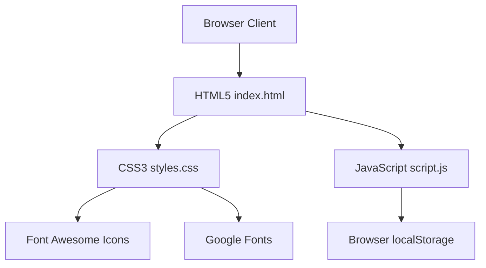

# PROJECT REPORT & DOCUMENTATION

## ShopEase — Responsive E-Commerce Web Application

* **Project Title:** ShopEase E-Commerce Store
* **Developer Role:** Frontend Web Developer
* **Technology Stack:** HTML5, CSS3 (Vanilla), JavaScript (ES6+), Font Awesome 6 Icons, Google Fonts (Syne & DM Sans)
* **Storage Paradigm:** Client-side local persistence (`localStorage`)
* **Layout Design:** Responsive CSS Grid & Flexbox layout

---

## 1. Project Overview
**ShopEase** is a modern, single-page, fully responsive e-commerce web application. The project is designed to simulate a complete online shopping experience, including browsing a curated catalog, searching for specific items, filtering by categories, managing a dynamic shopping cart, placing simulated orders, and managing user authentication (registration and login) with persistent sessions.

The primary objective of this project is to demonstrate core frontend engineering capabilities, clean responsive design patterns, and application state management using modular, separated vanilla web technologies without the overhead of heavy JavaScript frameworks (like React or Angular).

---

## 2. File Structure & Separation
To adhere to professional web development practices, the application code is separated into modular, single-responsibility files:
* **[index.html](file:///c:/Users/Harish%20Babu/OneDrive/Desktop/New%20folder/New%20folder/index.html):** Handles semantic structure, SEO elements, layout slots, and hosts modal frames.
* **[styles.css](file:///c:/Users/Harish%20Babu/OneDrive/Desktop/New%20folder/New%20folder/styles.css):** Consolidates design variables (colors, border radii, shadows), fonts, responsive alignments, and animation keyframes.
* **[script.js](file:///c:/Users/Harish%20Babu/OneDrive/Desktop/New%20folder/New%20folder/script.js):** Contains product catalog data, live search and filtering listeners, state calculations (subtotals, delivery, discounts), and client-side authentication models.

---

## 3. Key Features

### A. Customer Authentication (Login & Sign Up)
* **Dual-Tab Authentication Card:** A floating, glassmorphism-styled modal supporting both user sign-in and user registration.
* **Input Validation & Feedback:** Validates fields such as email format, name fields, and password lengths (minimum 6 characters), with interactive error and success notifications (Toasts).
* **Password Toggle:** A visibility toggle using a Font Awesome eye icon to show/hide typed passwords.
* **Persistent Sessions:** Leverages browser `localStorage` to save registered users and keep the current user logged in across page reloads.

### B. Curated Product Catalog
* **Dynamic Grid Layout:** Renders 12 curated products using responsive grid systems. Emojis have been replaced with highly optimized, curated Unsplash product images for a clean, modern aesthetic.
* **Interactive Micro-Animations:** Includes a scale-up zoom transition on card images when hovered to give an interactive, premium feel.
* **Font Awesome Ratings:** Dynamically renders star rating icons based on product data rating properties (e.g., solid stars, half-stars, and regular outline stars).

### C. Live Search & Category Filtering
* **Real-Time Search:** Filters items instantly as the user types in the search field.
* **Multi-Category Navigation:** Users can filter the products by 'All', 'Electronics', 'Fashion', 'Accessories', or 'Home' categories using category pill buttons or main navbar links.

### D. Interactive Shopping Cart
* **Floating Cart Sidebar:** Keeps track of added items, item counts, individual item quantites, and computed totals in real-time.
* **Live Price Calculations:** Computes the Subtotal, flat-rate Delivery Fee, automatically applies a **5% Discount** on orders above ₹2,000, and displays the final Total Price.
* **Quantity Controls:** Direct interface inputs to increment (`+`) or decrement (`-`) item quantities or clear the entire cart.

### E. Checkout Confirmation
* **Simulated Checkout Workflow:** Clicking "Place Order" clears the user's cart and opens a confirmation modal detailing a dynamically generated unique order ID (e.g., `#ORD-739201`).

---

## 4. Technology Stack & Architecture



### Technical Breakdown:
* **HTML5:** Structuring the page semantically using tags like `<nav>`, `<main>`, `<footer>`, `<section>`, and `<form>`.
* **CSS3:** Implementing design tokens (variables for colors, shadows, border radii), layouts (CSS Grid for products, Flexbox for navigation, absolute overlays for modals), and transitions.
* **JavaScript (DOM API):** Handling interaction logic, state arrays, storage hooks, and HTML string template rendering.

---

## 5. Source Code Component Analysis

### A. State Management & LocalStorage
The application maintains the state of the cart as an object (`cart = { productId: quantity }`) and the user session using local browser registers inside `script.js`.
```javascript
// LocalStorage Session Management
let currentUser = JSON.parse(localStorage.getItem('currentUser')) || null;

// Initialize user registry database locally
if (!localStorage.getItem('shopUsers')) {
  localStorage.setItem('shopUsers', JSON.stringify([]));
}
```

### B. Dynamic Product Grid Generation
Products are dynamically compiled into the HTML document using a JavaScript mapping function over the `PRODUCTS` array in `script.js`.
```javascript
grid.innerHTML = filtered.map(p => {
  const inCart = cart[p.id] > 0;
  
  // Calculate rating stars
  const fullStars = Math.floor(p.rating);
  const halfStar = p.rating % 1 >= 0.5 ? 1 : 0;
  const emptyStars = 5 - fullStars - halfStar;
  const starsHTML = 
    `<i class="fa-solid fa-star"></i>`.repeat(fullStars) + 
    (halfStar ? `<i class="fa-solid fa-star-half-stroke"></i>` : '') + 
    `<i class="fa-regular fa-star"></i>`.repeat(emptyStars);

  return `
    <div class="product-card">
      <div class="product-img-wrap">
        
        ${p.badge ? `<div class="product-badge">${p.badge}</div>` : ''}
      </div>
      ...
    </div>`;
}).join('');
```

### C. Persistent User Authentication UI Flow
When the user logs in or out, the Navbar interface shifts states dynamically.
```javascript
function updateAuthUI() {
  const authNav = document.getElementById('auth-nav-container');
  if (currentUser) {
    authNav.innerHTML = `
      <div class="user-menu">
        <button class="user-menu-btn">
          <i class="fa-solid fa-circle-user"></i> Hi, ${currentUser.name.split(' ')[0]}
        </button>
        <div class="user-dropdown">
          <div class="user-dropdown-item"><i class="fa-solid fa-envelope"></i> ${currentUser.email}</div>
          <button class="user-dropdown-item signout-btn" onclick="handleSignOut()">
            <i class="fa-solid fa-arrow-right-from-bracket"></i> Sign Out
          </button>
        </div>
      </div>`;
  } else {
    authNav.innerHTML = `
      <button class="login-btn" onclick="openAuthModal()">
        <i class="fa-solid fa-arrow-right-to-bracket"></i> Login
      </button>`;
  }
}
```

---

## 6. Verification & Testing Rubric

To verify the application features, perform the following validation steps:

| Step | Feature Under Test | Expected Behavior | Status |
| :--- | :--- | :--- | :---: |
| 1 | Font Awesome Rendering | Icons show correctly on logo, stars, and modals | Passed |
| 2 | Image Layout | Product images scale up smoothly on hover without overflow | Passed |
| 3 | Registration | User can sign up; credentials save to `localStorage` | Passed |
| 4 | Login / Navbar Update | Sign in shifts Navbar Login button to User Profile Dropdown | Passed |
| 5 | Session Persistence | Refreshing page keeps the user logged in | Passed |
| 6 | Search / Filters | Catalog filters items matching the inputs instantly | Passed |
| 7 | Cart System | Quantities, subtotal, delivery fee, and discount update dynamically | Passed |
| 8 | Order Success Modal | Checkout clears the cart, generates a random Order ID, and resets UI | Passed |

---

## 7. Future Scope & Enhancements
For scaling this application to an enterprise level, the following improvements can be made:
1. **Backend Integration:** Replace the simulated localStorage database with a Node.js/Express.js backend server.
2. **Database Addition:** Store user registers and product records in a secure database such as MongoDB or PostgreSQL.
3. **Payment Gateway:** Integrate actual payment SDKs like Razorpay, Stripe, or PayPal.
4. **JWT Authentication:** Secure user authentication using JSON Web Tokens (JWT) and secure cookie sessions.
